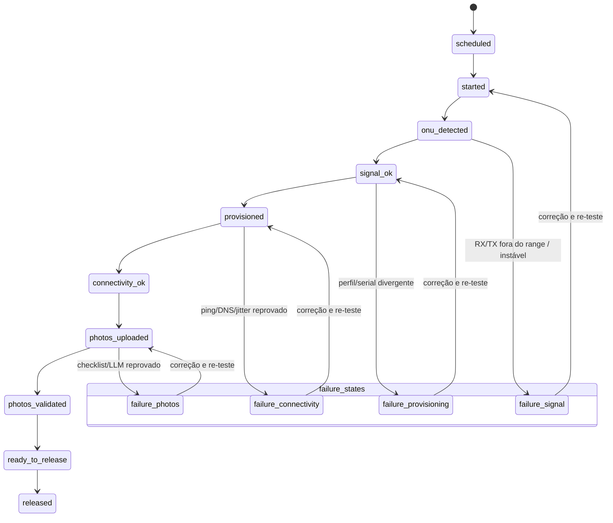
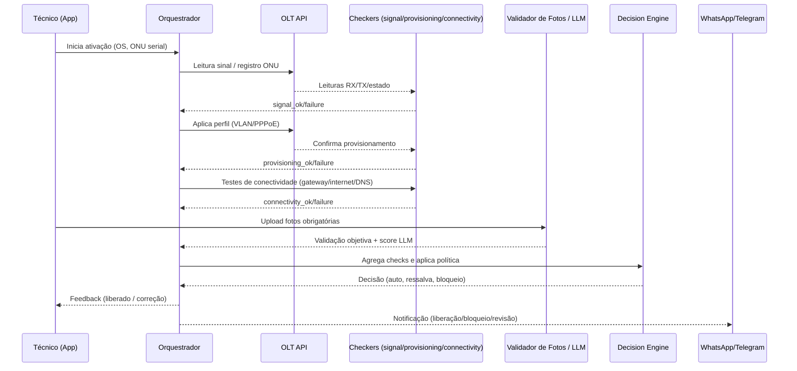

# Forma de Ativação — Plano de Automação “Por que não”

Documento de planejamento para automação do processo de ativação, aplicando princípios da “Tractian dos Provedores” (detecção por tendências, regras configuráveis e decisão automática com auditoria).

---

## 1) Objetivo

Automatizar e padronizar a ativação de clientes para reduzir retrabalho, acelerar liberação em campo e elevar a qualidade, com liberação automática quando todos os critérios forem atendidos e bloqueios claros quando houver risco.

Resultados alvo:

- Reduzir tempo médio de ativação em 66% (Técnico não tem mais que esperar Leandro ativar e auditar sinal, ele mesmo (técnico) tem permissão de ativar no sistema).
- Aumentar liberação a partir do Sistema, em outras palavras: A lei operacional do sistema decide se pode liberar o técnico ou não.
- Diminuir trabalho interno em 66% (Hoje fazem: Checagem das fotos + Ativação na SmarOLT + Checagem do Sinal / Proposta: Fazer apenas checagem da foto, Ativação os técnicos fazem e checagem de sinal fica na mão do própria Sistema)
---

## 2) Fluxo Atual vs. Fluxo Proposto

Fluxo atual (manual):
```
Técnico instala → ONU aparece na OLT → equipe interna confere sinal + fotos no WhatsApp → libera técnico
```

Fluxo proposto (automatizado “Por que não”):
```
Técnico instala → ONU detectada → sistema verifica sinal e aponta na interface-> Próprio técnico ativa -> Sistema valida a ativação dentro das regras/politicas de sinal -> Libera o técnico / Sugere mudanças para baixar o sinal.
```

Princípios:

- Evidência antes de decisão (checklist e dados objetivos).
- Politica de sinal máximo (Sistema só libera instalação como "OK" se bater checklist da politica de sinal).

---

## 2.1) Desenho — Arquitetura (alto nível)

```mermaid
graph LR
    T[App do Técnico<br/>(checklist + upload de fotos)] -->|Início / ONU detectada| O[Orquestrador]
    O --> SC[signal_checker]
    O --> PC[provisioning_checker]
    O --> CC[connectivity_checker]
    T -->|Fotos| PV[photo_validator]
    PV --> LLM[LLM Avaliação de Fotos]
    SC --> O
    PC --> O
    CC --> O
    PV --> O
    O --> DE[decision_engine]
    O --> DB[(Banco de Dados<br/>ativations + logs)]
    O --> UI[UI Operações]
    O -->|Perfil/Leituras| OLT[OLT API]
    OLT --> SC
    OLT --> PC
    DE -->|Liberação / Alertas| WPP[WhatsApp/Telegram]
```

---

## 2.2) Desenho — Fluxo de Estados



---

## 2.3) Desenho — Sequência em Campo



---

## 3) Checklists e Detectores

Itens de checklist (com detectores análogos à Tractian):

1. Sinal ótico
   - RX dBm dentro do range configurado (ex.: -8 a -28 dBm).
   - Estabilidade: N leituras em X minutos sem tendência de queda acentuada; sem LOS.
   - TX saudável; distância coerente com plano; sem flapping.

2. Provisionamento
   - ONU registrada (serial correto) e associada ao cliente/OS.
   - Perfil aplicado (VLAN/PPPoE/DHCP) sem erros.

3. Conectividade
   - Ping gateway e internet; resolução DNS; jitter/latência dentro dos limites.
   - M leituras consecutivas ok (tolerância a 1 retry).

4. Evidências fotográficas
   - Fotos obrigatórias completas: medição de potência visível, ONU instalada, rota do cabo, caixa de derivação, tomada/fonte.
   - Qualidade mínima (foco/iluminação); metadados (data/hora, localização) coerentes com OS.
   - Avaliação LLM: score ≥ threshold e sem flags críticas (ex.: curvatura excessiva, fiação exposta).

5. Anti-fraude/consistência
   - Geolocalização e timestamp compatíveis.
   - Serial da ONU = serial cadastrado na OS.
   - PON/porta conforme planejamento.

Classificação de decisão:
- Verde: atende regra → segue.
- Amarelo: não crítico → revisão rápida humana (SLA curto).
- Vermelho: crítico → bloqueio e orientação de correção.

---

## 4) Máquina de Estados da Ativação

Estados principais:
```
scheduled → started → onu_detected → signal_ok → provisioned → connectivity_ok →
photos_uploaded → photos_validated → ready_to_release → released

Falhas por etapa: failure_signal | failure_provisioning | failure_connectivity | failure_photos
```

Regras de transição:
- Cada etapa exige evidências/leituras; falhas registram motivo e ação recomendada.
- Deduplicação: impedir nova abertura enquanto existir run ativo para a OS/ONU.
- Timeouts e retries com backoff por etapa.

Liberação:
- Automática: todos os itens verdes e sem flags críticas.
- Com ressalva: até 1 amarelo não crítico → notificação para revisão rápida.
- Bloqueio: qualquer vermelho (ex.: RX fora do limiar, fotos ausentes/ilegíveis).

---

## 5) Modelagem de Dados (proposta)

- activation_templates
  - id, provider_id, name, version, rules (JSON: ranges RX/TX, estabilidade, conectividade, fotos obrigatórias, thresholds LLM, itens críticos/não críticos), created_at, created_by.

- activation_runs
  - id, provider_id, order_id, customer_id, olt_id, pon_id, onu_serial,
    state, state_reason, template_id, started_at, updated_at, released_at, technician_id.

- activation_checks
  - id, run_id, type (signal|provisioning|connectivity|photos), status (green|yellow|red),
    details JSON (leituras, métricas, justificativas), score, checked_at.

- activation_assets
  - id, run_id, type (photo_medidor|photo_onu|photo_rota_cabo|photo_caixa|photo_tomada),
    storage_url, exif (JSON com data/hora/GPS), hash, uploaded_at, by.

- ai_evaluations
  - id, run_id, asset_id (opcional), input_ref, output (score, flags, comentários), model, evaluated_at.

- audit_log
  - id, run_id, actor (system|user), action, from_state, to_state, message, created_at.

- integration_events
  - id, run_id, channel (whatsapp|telegram|webhook), payload, status, created_at, delivered_at.

Índices: por provider_id, run_id, onu_serial, state; retention e arquivamento após N dias.

---

## 6) Backend e Orquestração

Componentes:
- Orquestrador: state machine por `activation_run` aplicando `activation_templates`.
- Workers:
  - signal_checker: coleta leituras recentes (RX/TX/LOS/distância/flapping) e valida estabilidade.
  - provisioning_checker: verifica registro/serial e perfil aplicado na OLT.
  - connectivity_checker: executa/proxy de testes (gateway, internet, DNS, jitter/latência).
  - photo_ingestor: recebe fotos, extrai EXIF, calcula hash e armazena.
  - photo_validator: valida checklist objetivo e envia para LLM; agrega score/flags.
  - decision_engine: aplica política (verde/amarelo/vermelho), transiciona estado e dispara integrações.

Operação:
- Jobs assíncronos com retries/backoff; idempotência por run/etapa.
- Deduplicação por OS/ONU.
- Observabilidade: métricas, logs estruturados, tracing por run_id.
- Segurança: validação de payloads, limites de tamanho/quantidade de fotos, antivírus básico.

---

## 7) Frontend/UX

- Lista de ativações: filtros por status/OLT/PON/técnico/dia; contadores.
- Detalhe: gráfico de sinal curto, checks com verde/amarelo/vermelho, fotos com anotações, motivos da reprovação.
- Ações: reprocessar etapa, solicitar revisão humana, liberar manualmente com justificativa.
- App do técnico: checklist guiado, upload orientado (exemplos), validação instantânea por etapa, feedback claro.

---

## 8) LLM para Avaliação de Fotos

Critérios:
- Prompt estruturado com itens esperados e respostas restritas (JSON: score, flags críticas e não críticas).
- Itens: medição dBm legível; rota do cabo sem dobras severas; fixação da ONU; caixa/derivação identificada; tomada/fonte adequadas.
- Fallback: se LLM indisponível, rodar validações objetivas mínimas e enviar para revisão humana.
- Privacidade: descartar PII nas imagens; criptografia em repouso e trânsito; retenção mínima necessária.

---

## 9) Integrações

- OLT API: leitura de sinal/estado e aplicação de perfil (provisionamento).
- Mensageria (WhatsApp/Telegram): instruções do checklist e feedback de cada etapa para o técnico.
- Opcional: service desk externo (Zendesk/Freshdesk) para registrar incidentes se necessário.

---

## 10) Políticas, Limiares e Tolerâncias (iniciais)

- RX aceitável: provedor define (ex.: -8 a -28 dBm); TX saudável.
- Estabilidade: desvio < 1 dB em 10–15 min, sem flapping.
- Conectividade: 2 de 2 checks ok com 30s de intervalo.
- Fotos/LLM: score ≥ 0,75, sem flags críticas; até 1 amarelo libera revisão rápida.
- Críticos x não críticos: definidos no `activation_template` por provedor.

---

## 11) Métricas, KPIs e Telemetria

- Taxa de liberação automática vs. manual.
- Tempo por etapa (sinal, provisionamento, fotos, etc.).
- Retrabalho em até 7 dias pós-ativação.
- Principais motivos de bloqueio; técnicos/áreas com maior incidência.
- Disponibilidade/latência dos checkers e da LLM.

---

## 12) Plano de Entrega

Fase 1 — Core (2–3 semanas)
- DB e state machine; checkers: sinal, provisionamento, conectividade.
- Tela básica de ativações e detalhe; liberação manual.
- Integração OLT mínima e logs/telemetria.

Fase 2 — Fotos/LLM (2–3 semanas)
- Upload guiado, validações objetivas, integração LLM, política de liberação automática.
- Notificações (WhatsApp/Telegram) para técnico.

Fase 3 — UX e Operação (2–3 semanas)
- Dashboards, auditoria completa, métricas KPIs, ajustes finos de templates.
- Piloto com 1–2 equipes; coleta de feedback e tuning de thresholds.

---

## 13) Riscos e Mitigações

- Falsos positivos/negativos do LLM: começar com lista objetiva forte e usar LLM como reforço; revisão humana para amarelos.
- Instabilidade de leituras iniciais: exigir janela mínima de estabilização (ex.: 10–15 min).
- Divergência de perfil/serial: bloqueio automático com instrução de correção.
- Latência de integrações: fila assíncrona, timeouts e reprocessamento.

---

## 14) Custos e Infra

- Armazenamento de imagens com retenção mínima (ex.: 90 dias) e compressão.
- Orquestração com workers leves; escalonamento horizontal por fila.
- Custos de LLM: otimizar com prompts enxutos e inferência somente quando checklist objetivo estiver ok.

---

## 15) Governança

- Templates aprovados por responsável técnico do provedor; versionamento obrigatório.
- Liberação manual sempre possível com justificativa e auditoria.
- Trilhas de auditoria completas por run.

---

## 16) Próximos Passos

1. Validar com operações os itens do checklist e limites iniciais.
2. Aprovar modelagem de dados e estados.
3. Iniciar Fase 1 (DB + state machine + três checkers + UI básica).
4. Planejar piloto (equipes, OLT/PON, metas de KPI).
