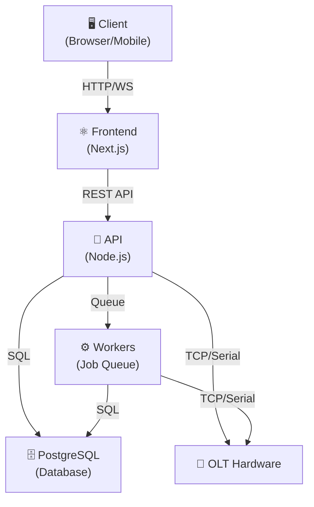
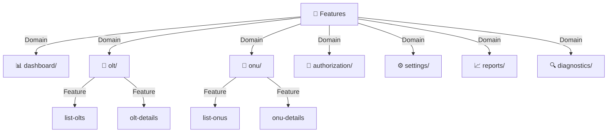
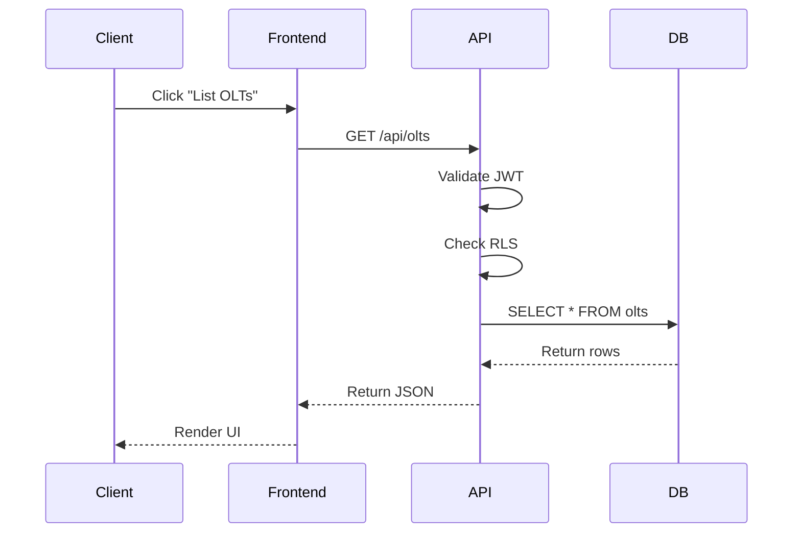
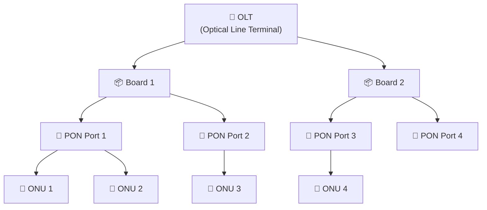
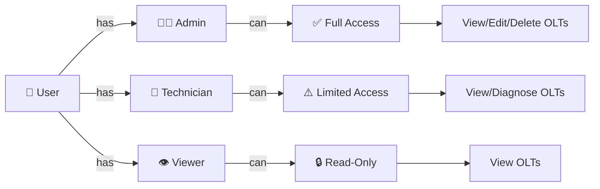
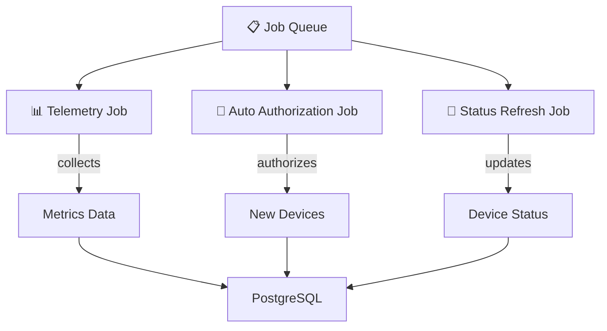
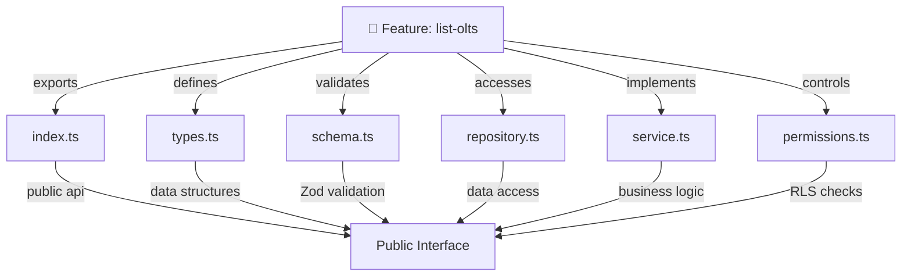
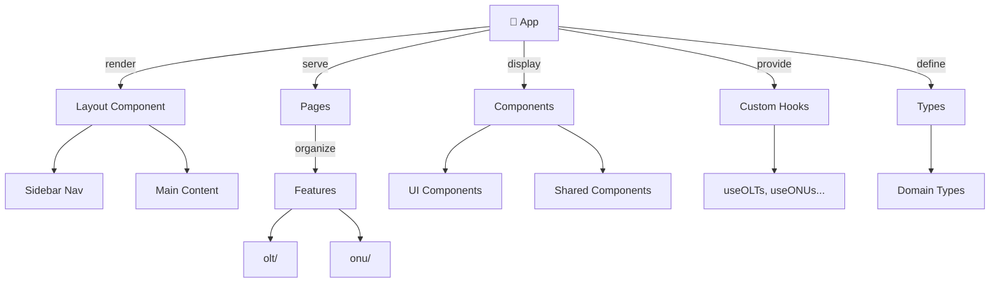

# Mermaid Diagrams

Diagramas em formato Mermaid para referência visual.

## Component Diagram

## Feature Architecture

## Data Flow (Simple Feature)

## OLT Hierarchy

## Role-Based Access Control

## Worker Jobs

## Feature Structure Example

## Frontend Structure

## Próximas Adições

- Diagramas de autenticação (OAuth, JWT)
- Diagramas de deployment
- Diagramas de escalabilidade
- Diagramas de disaster recovery
